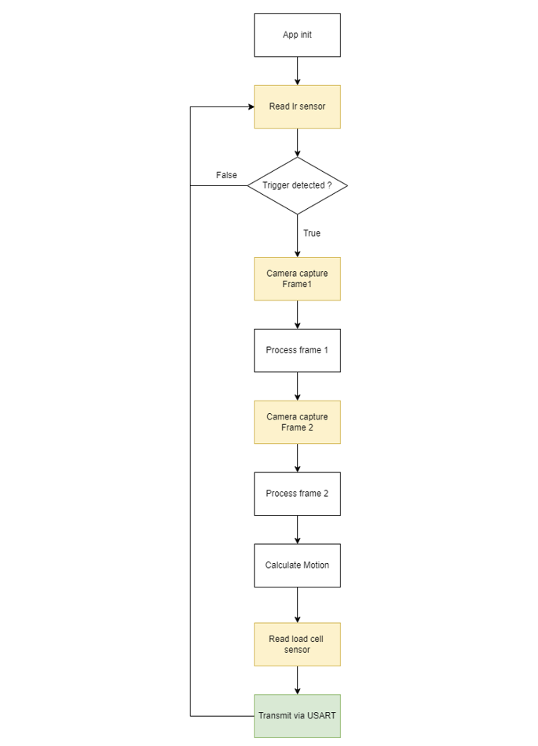
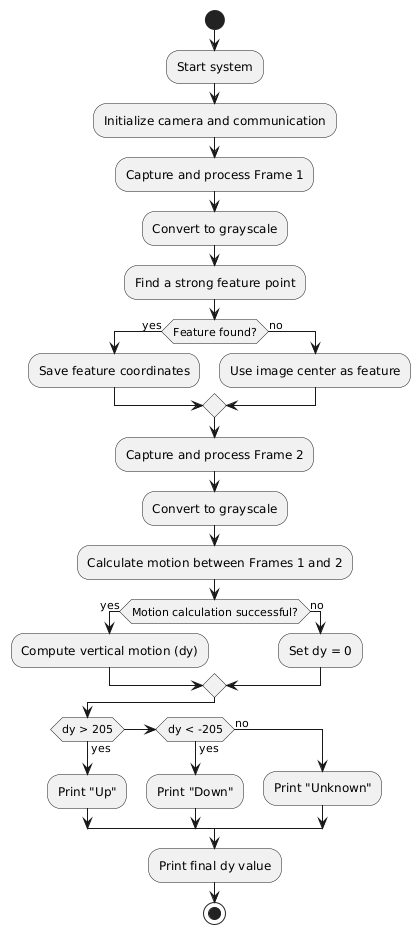

1. Download [Simplicity Studio](https://www.silabs.com/documents/login/software/SimplicityStudio-5.iso)
2. Download [Gecko SDK](https://github.com/SiliconLabs/gecko_sdk.git)
3. Add Gecko SDK to Simplicity Studio
4. Download [ReNode](https://github.com/renode/renode/releases/download/v1.15.3/renode_1.15.3.msi) to emulate EFR32MG24

## USART
- TRansmit: direction motion

## Silmotion_xG12
- Main flow

- Caculate motion flow

## RAM Usage Timeline (Summary)

| **Phase**              | **Memory Type** | **Variables/Buffers**                                                                                        | **RAM Usage (Total)** |
| ---------------------- | --------------- | ------------------------------------------------------------------------------------------------------------ | --------------------- |
| **Initialization**     | **Heap**        | `frame_buffer` (\~28.8 KB)                                                                                   | **\~29 KB**           |
|                        | **Stack**       | `frame1_data`, `frame2_data` (\~200 B)                                                                       |                       |
| **Frame Processing 1** | **Heap**        | `frame_buffer` (\~28.8 KB), `gray_buffer` (\~14.4 KB), `pyr_buffer` (\~18 KB), `grad_buffer_local` (\~72 KB) | **\~133.5 KB**        |
|                        | **Stack**       | Temporary variables (\~100 B)                                                                                |                       |
| **Frame Processing 2** | **Heap**        | Reuses `frame_buffer`, `gray_buffer`, `pyr_buffer`, `grad_buffer_local`                                      | **\~133.5 KB**        |
|                        | **Stack**       | Temporary variables (\~100 B)                                                                                |                       |
| **Motion Calculation** | **Heap**        | Reuses `frame_buffer`, `gray_buffer`, `pyr_buffer`, `grad_buffer_local`                                      | **\~133.6 KB**        |
|                        | **Stack**       | Temporary variables (\~200 B)                                                                                |                       |
| **Final State**        | **Heap**        | Persistent buffers: `frame_buffer`, `gray_buffer`, `pyr_buffer`, `grad_buffer_local`                         | **\~133.2 KB**        |
|                        | **Stack**       | Released after `app_init`                                                                                    |                       |
